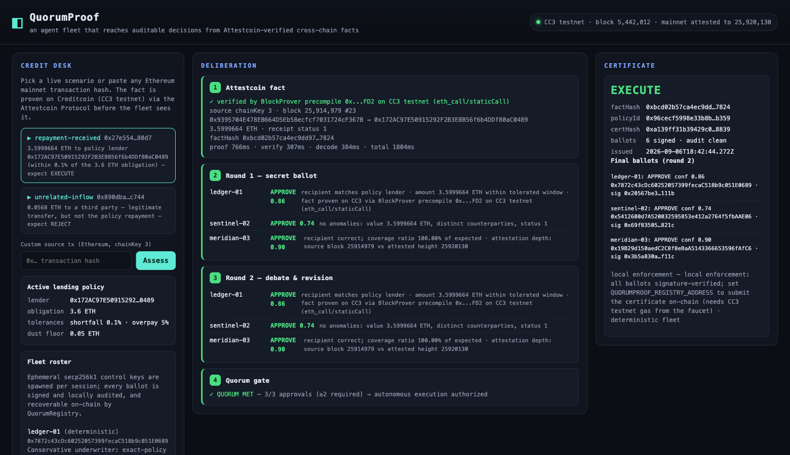

# QuorumProof

**An agent fleet that reaches auditable decisions from Attestcoin-verified cross-chain facts — on Creditcoin.**

Three heterogeneous AI agents independently deliberate over a transaction that has been
cryptographically proven inside Creditcoin's trust domain (Attestcoin Protocol, BlockProver
precompile `0x…FD2` on CC3 testnet). They vote in a secret ballot, debate, revise under
documented rules, and only when quorum is met does the fleet authorize the on-chain action.
Every step — the proof, both ballots, every signature, the certificate — is recorded and
independently verifiable. No centralized oracle operator, no single-model authority.

BUIDL CTC 2026 Fall entry · **AI track** (#AI Agents #Onchain Decisioning #Verified Data)



---

## Why a fleet

A single AI agent is a single point of failure with a confident voice. QuorumProof treats
autonomous decisioning the way consensus treats blocks: **no one agent can move value alone.**
The agents are heterogeneous by design — different mandates, different failure modes — so
quorum is a real check, not three copies of one opinion:

| Agent | Mandate | Deliberates on | Round-2 revision rule |
|---|---|---|---|
| `ledger-01` | Conservative underwriter — exact-policy compliance or nothing | policy fit | never revises (conviction) |
| `sentinel-02` | Fraud & anomaly control — transaction integrity only, never policy fit | integrity | as sole approver facing a declined fleet: keeps the dissent, discounts confidence, states why |
| `meridian-03` | Market & timing analyst — partial repayments get weighted, not zeroed | materiality vs policy | as sole denier facing a unified approving fleet: softens DENY to ABSTAIN |

An optional fourth **LLM analyst** joins when any OpenAI-compatible endpoint is configured
(`QUORUMPROOF_LLM_URL` / `_MODEL` / `_API_KEY`). The default demo runs fully deterministic:
zero paid services, zero keys, fully reproducible.

## The pipeline (all of it real, all of it free)

```
Ethereum mainnet tx
   │  1. Attestcoin ProofBuilder (hosted proof service, testnet)
   ▼
inclusion proof (Merkle) + continuity proof (attestation chain)
   │  2. BlockProver precompile 0x…FD2 on CC3 testnet — eth_call (staticCall)
   ▼
FACT VERIFIED IN CREDITCOIN'S TRUST DOMAIN        ← no gas, no private key
   │  3. on-chain EvmV1Decoder library — eth_call
   ▼
structured fact (from, to, value, receipt status) + factHash
   │  4. fleet deliberation: round 1 secret ballot → debate → round 2
   ▼
signed QuorumCertificate (6 secp256k1 ballots bound to factHash)
   │  5. enforcement: local signature audit, or QuorumRegistry submission
   ▼
EXECUTE / REJECT — recorded, auditable, replayable
```

Steps 1–4 run live in under 3 seconds. Try it:

```bash
npm install
npm run verify-live   # prove a real mainnet tx on CC3 testnet (reads only)
npm run demo          # full fleet: EXECUTE path + REJECT path
npm run serve         # dashboard at http://localhost:8787
npm test              # offline quorum/certificate suite
npm run build         # tsc strict, green
```

## What the judges can verify in one minute

- **Live Attestcoin integration**: `npm run verify-live` → a real Ethereum mainnet
  transaction (3.5999664 ETH, block 25,914,979) proven and verified by Creditcoin's
  BlockProver precompile. All network calls are reads (REST + eth_call) — runs with zero tokens.
- **Live autonomous decisioning**: `npm run demo` → the fleet EXECUTEs the matching
  repayment 3/3, and REJECTs an unrelated inflow 1/3 with a documented, signed dissent.
- **Auditability**: every ballot signature recovers to the agent's control address
  (`npm test` proves tampering is detected); the certificate hash binds decision → fact → policy.
- **UI**: `npm run serve` → watch the fleet deliberate in real time.

## Judging-criteria map (BUIDL CTC 2026 Fall)

| Criterion (from the official brief) | What QuorumProof demonstrates | Where to look |
|---|---|---|
| **Meaningful, functional Attestcoin Protocol integration** (depth is a core scoring criterion) | The protocol IS the trust boundary: proof build (ProofBuilder), on-chain verification (BlockProver precompile via SDK `PrecompileBlockProver`), on-chain decoding (`EvmV1Decoder`), chain-key registry (`ChainInfo` precompile), and `QuorumRegistry` for writing decisions back | `src/attest/gateway.ts`, `scripts/verify-live.ts`, `contracts/QuorumRegistry.sol` |
| **AI track: apps that process cryptographically verified cross-chain data to autonomously inform decisions** | Agents only ever see facts that passed precompile verification; they decide autonomously (two-round deliberation, no human in the loop) | `src/agents/`, `src/pipeline.ts` |
| **…and trigger on-chain transactions without centralized oracle operators** | Quorum-gated EXECUTE authorizes on-chain action; `QuorumRegistry.submitDecision` records it as Creditcoin state (recovers all ballots on-chain); the fact itself arrived via precompile — no oracle operator anywhere | `contracts/QuorumRegistry.sol`, `src/chain/registry.ts` |
| **Original work created during the hackathon** | Authored 2026-09-06 for this event; git history is the provenance record | `git log` |
| **Deployed on a testnet** | All live calls hit CC3 testnet (`rpc.cc3-testnet.creditcoin.network`); verified mainnet facts via the testnet's chainKey 3; registry contract ships ready to deploy (see faucet note) | `src/config.ts`, `docs/attestcoin-integration.md` |
| **Technical documentation of the setup** | `docs/attestcoin-integration.md` — endpoints, addresses, digest formats, trust model | `docs/` |
| **Submission completeness** | repo + README (this file), integration summary, deck/whitepaper, demo video, demo script, checklist | `docs/submission-checklist.md` |

> The brief publishes no numeric judging weights. Where depth is called out — Attestcoin
> utilization — QuorumProof goes deep: four distinct protocol touchpoints, all exercised live.

## Repository layout

```
src/
  config.ts             endpoints, chain keys, demo txs (public infra only)
  pipeline.ts           facade: attest → deliberate → enforce
  attest/gateway.ts     AttestcoinGateway — the trust boundary (proof, verify, decode)
  agents/
    types.ts            facts, votes, certificates
    brains.ts           ledger / sentinel / meridian + optional LLM analyst
    fleet.ts            2-round deliberation, quorum gate, signature audit
    certificate.ts      canonical ballot digest (byte-exact with the Solidity registry)
  chain/registry.ts     certificate enforcement (local + on-chain submission)
  server.ts             node:http dashboard API
  web/                  dependency-free dashboard UI
contracts/QuorumRegistry.sol   on-chain quorum gate (CC3-ready)
scripts/verify-live.ts          live Attestcoin proof CLI
test/fleet.test.ts              offline quorum/certificate tests (10)
design-shots/                   dashboard screenshots (Playwright)
docs/                           integration notes, demo script, submission checklist
```

## Testnet & cost story (zero-budget compliant)

- Everything live runs against **CC3 testnet** and public Ethereum RPCs. No paid services,
  no API keys, no secrets. `npm audit` is clean (0 vulnerabilities, prod and dev).
- Precompile verification and on-chain decoding are `eth_call`s: **free, keyless, real.**
- The optional on-chain WRITE (`QuorumRegistry`) needs CC3 testnet gas. Faucet path:
  Creditcoin Discord (`discord.gg/Gu43zTfmtc`, #buidl-ctc-qna for builder support) —
  tokens are requested, never purchased. Until a faucet grant lands, the contract ships
  with tests and the decision flow runs in local-enforcement mode (clearly labeled).

## Honest limitations

- Default agent brains are deterministic analytic evaluators (auditable, reproducible).
  The LLM analyst is wired but off by default so the demo never depends on a paid API.
- `QuorumRegistry` is written for CC3 testnet deployment but is not yet deployed (faucet-gated);
  the certificate flow is otherwise complete end to end.
- Demo txs are fixed mainnet transfers chosen to sit below the testnet's attested height;
  any mainnet tx below that height works via the custom-input box.

## License

MIT.
